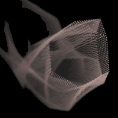
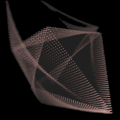
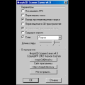

# Morph3D Screen Saver

Morph3D Screen Saver is a screen saver for Windows, that draws rotating 3D-objects like spheres, dodecaedr, icosaedr, torus, spiral, cube, tetraedr and others. All objects consist of shining points. One object periodically transforms to another (effect "morphing"). Points leave a trace that is "erasing" by one of three effects, the best is fire effect.  

  

Available options:
* "Show FPS" - show the count of frames per second (it is specially limited - 100 "FPS")
* "Mix points". If it is set, then at the time of morphing points moves "chaosically". Else points will move by a little groups
* "Exit if mouse moved". If it is set, then screen saver will exit if move mouse pointer
* "Moving of the object center". If option is set, object moves also forward-backward
* "Primitive Point Draw" - only for slow computers. Points are quadratic (not circle) and FPS grows up
* "Hues of gray" - points have no color
* "Trace" - points leaves trace, erasing by three different effects : "simple", "diffuse" and "fire". You can also set its length.
* Screen Saver has the password protection

Sergey Chernov a.k.a. seregamorph

